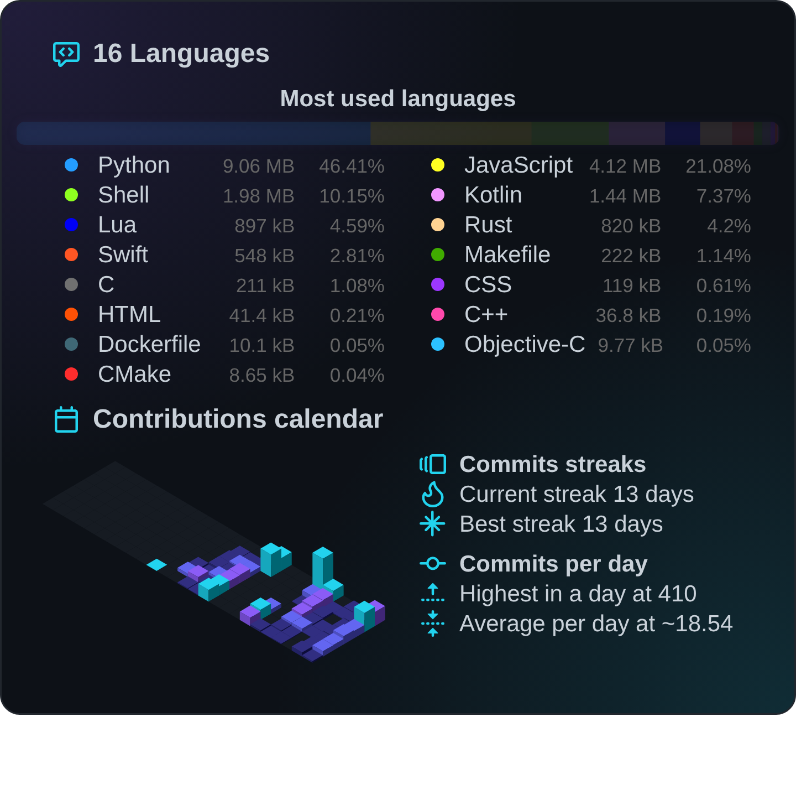
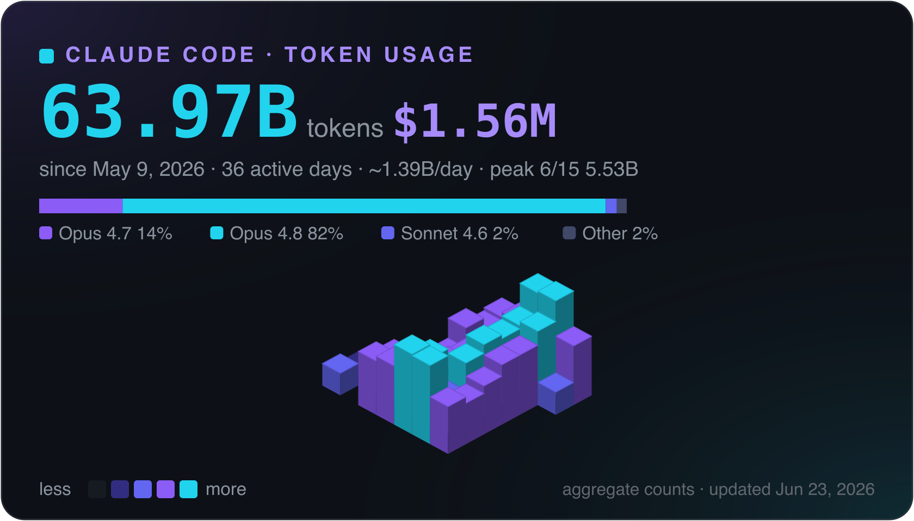

# Hi, I'm Michael &nbsp;·&nbsp; [`@convenientlymike`](https://github.com/convenientlymike)

  
  
  
  

**I build and own entire backends end-to-end** — the AI automation, CRMs, and custom internal systems that run a **real estate investment firm**, plus the courses platform that trains the team. On top of that, I ship **full SaaS products**, front to back.

Much of that product work lives in **real-estate tech** — an investment firm's operational backend, a property-tour SaaS, and a wholesaling platform — so I pair real domain fluency with the range to build whatever layer the problem needs.

> **The throughline:** when a system has no API, no docs, or no abstraction left to lean on, I drop to the kernel and reverse-engineer it myself. I build the high-level product *and* the low-level machinery underneath it — so I'm rarely blocked by "that's not exposed." **Kernel to cloud, I build all of it.**

### 🚧 What I'm building right now

- **The operational backend of a real estate investment firm** — AI automation, CRM, custom ops tooling, and a courses platform, owned end to end. **200+ automations in production doing the work of several full-time roles — built in under a year.** *(Proprietary — sanitized write-up below.)*
- **Virtual House Tours** — a full property-tour SaaS: native iOS capture, web viewer + dashboard, Tauri desktop, a Fastify API, and Stripe billing.
- **A real-time multiplayer game-server framework & a defensive, server-authoritative anti-cheat** — ground-up and standalone (no off-the-shelf base): a 37-spec architecture blueprint, a 50-doctrine engineering constitution, and a security core where the server is the only source of truth and the client is treated as hostile input. **The hero is the verification: a 289/289-green mock suite hid eight real bugs** (a money-sign error, hydrate-vs-DB seeding gaps, a fail-*open* create path, a column/NOT-NULL mismatch) — only a real-database gate exposed them. Ledger-as-truth economy on MariaDB, an event-bus hardened choke point, a premium React 19 in-game UI. *(Commercial · private — sanitized write-up below.)*
- **SteelToe** — a verified-reputation network for the skilled trades: a single-player owner hiring tool that turns a worker's reliability into a portable, verified asset, designed to dodge the labor-marketplace trap and built compliance-first (EEOC / FCRA / defamation). *(Private · design + v0 — sanitized write-up below.)*
- **Deep-systems engineering** — custom Android platform + GKI Linux kernel work, dynamic instrumentation, and a Vulkan↔Metal GPU translation path.

### 📌 Selected work

> Most of my highest-leverage work is proprietary or client code and lives in private repos. I publish **sanitized architecture write-ups** instead of the source → **[case studies →](https://github.com/convenientlymike/case-studies)**. Happy to walk through any of it in depth on a call.

| Project | What it is | Stack |
|---|---|---|
| ⭐ **Real-estate firm backend** *(flagship · private)* | The complete software backbone of an investment firm — AI automation, CRM, custom internal platforms, courses. **200+ production automations replacing several full-time roles.** | `Python` · `FastAPI` · `TypeScript` · `LLM orchestration` · `Postgres` |
| 🏠 **Virtual House Tours** *(in development)* | Full property-tour SaaS — iOS app, web + dashboard, Tauri desktop, signed-URL delivery, Stripe billing, background workers. | `TypeScript` · `iOS` · `Fastify` · `Postgres` · `Redis` · `S3` |
| 🏘️ **Real-estate wholesaling platform** *(private)* | A wholesaling software stack — Next.js web, a Go service for seller outreach/telephony, a FastAPI AI lead layer, Temporal deal workflows, ClickHouse analytics, Kafka streaming. | `Next.js` · `Go` · `FastAPI` · `Temporal` · `ClickHouse` · `Kafka` |
| 🦺 **SteelToe — verified-reputation network for the trades** *(design · v0 · [case study](https://github.com/convenientlymike/case-studies/blob/main/12-steeltoe-reputation-network.md))* | A reputation layer for trades hiring — turn a worker's reliability into a **portable, verified asset** so an owner can tell the grinders from the flakes *before* hiring. **Owner-tool-first** to dodge the labor-marketplace trap (matching has no moat — even a >$750M incumbent exited the space); the reputation/verification schema is designed around **EEOC / FCRA / defamation**. Honest framing: *v0 proves the tool, not the network.* | `Next.js` · `TypeScript` · `Prisma` · `Postgres` |
| 🎮⚔️ **Real-time multiplayer game-server framework & defensive anti-cheat** *(commercial · private)* | Ground-up, server-authoritative framework — a module loader + phase state-machine spine, an event-bus **7-stage hardened choke point** (malformed → unknown-event → protocol → resolve → rate-limit → validate → dispatch) every inbound message must traverse, identity / permissions / economy domains, a **ledger-as-truth** economy on MariaDB (append-only, partition-ready, fail-closed write-through, crypto-shred GDPR schema). Premium **React 19 + Vite 6** in-game UI — gamepad-first, fully rebindable keybinds, focus-tracking. Verified by a **3-tier ladder**: mock (<1s) → real-DB boot-smoke (the authoritative gate — caught 8 bugs a 289/289 mock suite missed) → synthetic N-player load. | `Lua` · `TypeScript` · `React` · `MariaDB` · `Docker` · `Server-authoritative` |
| 🔬 **Verification ladder & biting quality gates** *(methodology · [case study](https://github.com/convenientlymike/case-studies/blob/main/10-multiplayer-game-framework-verification.md))* | The "the real database is the truth" approach, formalized: mock-native load test (license-free, <1s) → real-DB boot-smoke (the authoritative tier) → synthetic concurrent traffic. Plus an **11-check static gate** (secrets, server-authority, unguarded events, NUI focus-arbiter, perf budget) — each shipped **with a negative-control fixture** + a `--self-test` meta-gate proving every check goes **red** on bad input. A cross-language parity gate pins a `Lua` server impl and a `TypeScript` UI port to one shared **golden vector** (29 rows, `.5`-rounding edges included) so the two can't drift. | `Testing` · `Quality gates` · `Lua` · `TypeScript` · `MariaDB` · `Python` |
| 🎛️ **`dma-manager` — hardware control plane** | Premium real-time control plane for hardware controllers — 30 Hz telemetry, a clean hardware-abstraction layer (sim → probe → PCIe → serial → remote), hardened API, and a **brick-safe firmware lifecycle** (detect → back up → flash → verify) driven by a guided onboarding wizard. | `TypeScript` · `React` · `FastAPI` · `real-time HAL` |
| 🧱🛡️ **[`bricksafe`](https://github.com/convenientlymike/bricksafe)** *(open source)* | Never brick a device — the safe-by-construction firmware-write core, extracted + made domain-neutral: one write-gate (backup-before-write hard gate, byte-level placeholder guard, read-before-write CAS, confirm-readback, undo + audit). Zero runtime deps, `mypy --strict`. | `Python` · `embedded` · `safety` |
| 🔬 **Low-level systems & RE** | From-scratch systems stack: custom GKI 5.15 Linux kernel, Android platform engineering, dynamic instrumentation, native reverse engineering, GPU translation. | `C` · `Kotlin` · `Instrumentation` · `Vulkan` · `Metal` · `AOSP` |
| 🧬 **[Game-asset CDN reverse engineering](https://github.com/convenientlymike/case-studies/blob/main/11-unity-asset-cdn-re.md)** *(methodology · case study)* | Recovering the exact asset-CDN URL a shipping **Unity / IL2CPP** game resolves at *runtime* (it isn't a literal) — static string-hunt → disassembling the base accessor → a **passive `/proc/mem` pointer-chase** (ELF VA→runtime mapping, with a built-in correctness gate so a wrong offset fails loud, not silent) → **verified by byproduct** against the on-disk catalog hash. Plus the infallible fetcher: per-byte integrity check with a **negative control that bites**, resumable, exact request replication. | `Reverse engineering` · `IL2CPP` · `Unity` · `Python` · `ARM64` |
| ✅ **[Forcing-function engineering](https://github.com/convenientlymike/case-studies/blob/main/07-forcing-function-completeness.md)** *(methodology)* | Making "done" machine-checkable — every quality doctrine encoded as a lint gate or test that fails the moment it's broken (route↔UI coverage, one-audited-write-path, risk-badging, docs-can't-drift), plus a multi-agent completeness audit that drove a 40+ finding sweep to zero. | `Quality gates` · `CI` · `Python` · `TypeScript` |
| 🧪 **[Browser Harness](https://github.com/convenientlymike/browser-harness)** | Autonomous CDP-driven debugging + observability toolkit — drives a real browser, captures runtime/network failures, turns "looks fine" into "proven." | `Python` · `Node` · `Playwright` · `CDP` |
| 🛰️ **[Fleet](https://github.com/convenientlymike/fleet)** | Parallel-agent compatibility for Claude Code — open many windows on one project; an edit to a file a *live* agent has claimed is hard-blocked at the hook (exit 2). Just files + 4 hooks, no daemon. | `Bash` · `Claude Code hooks` · `CLI` |
| 🩺 **[svgsafe](https://github.com/convenientlymike/svgsafe)** | Make SVGs render everywhere — diagnose the iOS/WebKit `<foreignObject>` clipping traps, auto-fix them, or rasterize to a crisp transparent PNG. Zero runtime deps; in-browser playground. | `TypeScript` · `Node` · `CLI` |
| 🖼 **[shotcraft](https://github.com/convenientlymike/shotcraft)** | Turn real terminal output or a before/after into a beautiful, brand-matched PNG for your README — a themeable Carbon + diff framer rendered by your installed Chrome (over CDP). Zero runtime deps; in-browser playground. | `TypeScript` · `Node` · `CLI` |
| 🧊 **[claude-usage-graph](https://github.com/convenientlymike/claude-usage-graph)** | Turn your Claude Code token usage into a 3D isometric calendar — a contribution-graph-style card built from local session transcripts (aggregate counts only). Four themes, optional PNG. Zero required deps; in-browser playground. | `TypeScript` · `Node` · `CLI` |
| 🖥️ **[x86-interactive-on-arm](https://github.com/convenientlymike/x86-interactive-on-arm)** *(open source)* | Run x86-only **interactive-console** server binaries on Apple Silicon — the two-field Colima + Compose recipe (`--cpu-type max` + `stdin_open`) that turns a phantom, every-run **exit-139** "emulation segfault" into a clean boot. The diagnosis: a *deterministic* exit code means a deterministic *cause*, not emulation jitter. | `Colima` · `Docker` · `QEMU` · `macOS` · `shell` |

### 🧰 Core stack

What I reach for daily — surfaced in-context above; here's the spine:

Languages measured from real code across my repos — <em>including private work</em> — with a live contribution calendar:

And the volume behind it — total Claude Code tokens, with a 3D calendar of daily usage (aggregate counts from local sessions):

### 🤝 Let's build something

I take the problems people call impossible — the cross-layer ones, the "no one's done this," the ones that need someone equally at home in a React component and a kernel patch.

**Open to** founding-engineer work · fractional CTO · advisory · select consulting.

💼 [LinkedIn](https://www.linkedin.com/in/michaelfbirney) &nbsp;·&nbsp; ✉️ [convenientlymike@gmail.com](mailto:convenientlymike@gmail.com)

 

  
<em>From the kernel to the cloud — I build all of it.</em>

