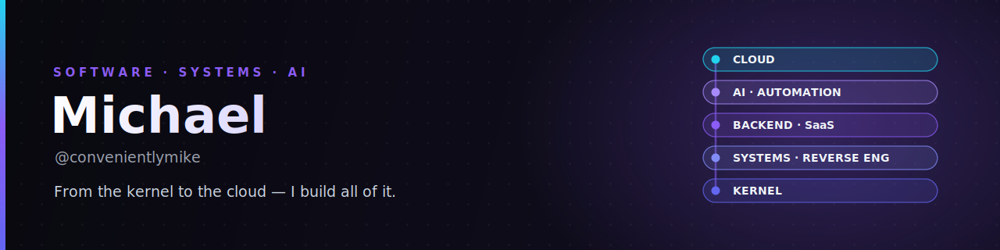

# Hi, I'm Michael &nbsp;·&nbsp; [`@convenientlymike`](https://github.com/convenientlymike)

  
  
  
  

**I build and own entire backends end-to-end** — the AI automation, CRMs, and custom internal systems that run a **real estate investment firm**, plus the courses platform that trains the team. On top of that, I ship **full SaaS products**, front to back.

Much of that product work lives in **real-estate tech** — an investment firm's operational backend, a property-tour SaaS, and a wholesaling platform — so I pair real domain fluency with the range to build whatever layer the problem needs.

> **The throughline:** when a system has no API, no docs, or no abstraction left to lean on, I drop to the kernel and reverse-engineer it myself. I build the high-level product *and* the low-level machinery underneath it — so I'm rarely blocked by "that's not exposed." **Kernel to cloud, I build all of it.**

### 🚧 What I'm building right now

- **The operational backend of a real estate investment firm** — AI automation, CRM, custom ops tooling, and a courses platform, owned end to end. **200+ automations in production doing the work of several full-time roles — built in under a year.** *(Proprietary — sanitized write-up below.)*
- **Virtual House Tours** — a full property-tour SaaS: native iOS capture, web viewer + dashboard, Tauri desktop, a Fastify API, and Stripe billing.
- **Deep-systems engineering** — custom Android platform + GKI Linux kernel work, dynamic instrumentation, and a Vulkan↔Metal GPU translation path.

### 📌 Selected work

> Most of my highest-leverage work is proprietary or client code and lives in private repos. I publish **sanitized architecture write-ups** instead of the source → **[case studies →](https://github.com/convenientlymike/case-studies)**. Happy to walk through any of it in depth on a call.

| Project | What it is | Stack |
|---|---|---|
| ⭐ **Real-estate firm backend** *(flagship · private)* | The complete software backbone of an investment firm — AI automation, CRM, custom internal platforms, courses. **200+ production automations replacing several full-time roles.** | `Python` · `FastAPI` · `TypeScript` · `LLM orchestration` · `Postgres` |
| 🏠 **Virtual House Tours** *(in development)* | Full property-tour SaaS — iOS app, web + dashboard, Tauri desktop, signed-URL delivery, Stripe billing, background workers. | `TypeScript` · `iOS` · `Fastify` · `Postgres` · `Redis` · `S3` |
| 🏘️ **Real-estate wholesaling platform** *(private)* | A wholesaling software stack — Next.js web, a Go service for seller outreach/telephony, a FastAPI AI lead layer, Temporal deal workflows, ClickHouse analytics, Kafka streaming. | `Next.js` · `Go` · `FastAPI` · `Temporal` · `ClickHouse` · `Kafka` |
| 🎛️ **`dma-manager` — hardware control plane** | Premium real-time control plane for hardware controllers — 30 Hz telemetry, a clean hardware-abstraction layer (sim → probe → PCIe → serial → remote), hardened API. | `TypeScript` · `React` · `FastAPI` · `real-time HAL` |
| 🔬 **Low-level systems & RE** | From-scratch systems stack: custom GKI 5.15 Linux kernel, Android platform engineering, dynamic instrumentation, native reverse engineering, GPU translation. | `C` · `Kotlin` · `Instrumentation` · `Vulkan` · `Metal` · `AOSP` |
| 🧪 **Browser Harness** | Autonomous CDP-driven debugging + observability toolkit — drives a real browser, captures runtime/network failures, turns "looks fine" into "proven." | `Python` · `Node` · `Playwright` · `CDP` |

### 🧰 Core stack

What I reach for daily — surfaced in-context above; here's the spine:

Languages measured from real code across my repos — <em>including private work</em> — with a live contribution calendar:

### 🤝 Let's build something

I take the problems people call impossible — the cross-layer ones, the "no one's done this," the ones that need someone equally at home in a React component and a kernel patch.

**Open to** founding-engineer work · fractional CTO · advisory · select consulting.

💼 [LinkedIn](https://www.linkedin.com/in/michaelfbirney) &nbsp;·&nbsp; ✉️ [convenientlymike@gmail.com](mailto:convenientlymike@gmail.com)

 

  
<em>From the kernel to the cloud — I build all of it.</em>

